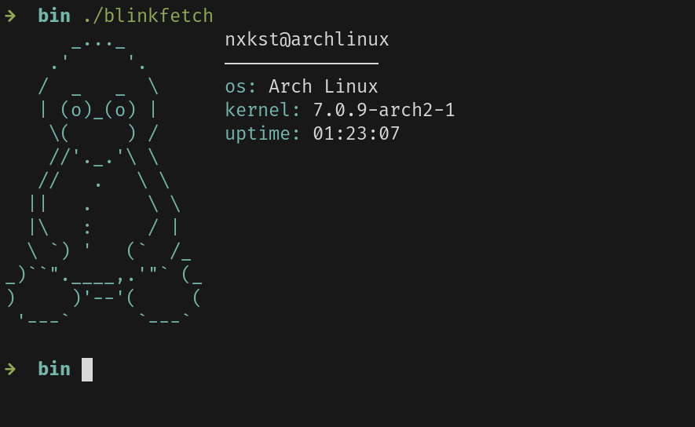

# Blinkfetch

The fetch tool for Linux written in Go.

I am learning go and it's my first open source project.



## Installation

You need to have Go on your system to install Blinkfetch.

Run the following command in your terminal:
```bash
go install github.com/nxkst/blinkfetch/cmd/blinkfetch@latest
```

Or clone the repo and build locally:
```bash
git clone https://github.com/nxkst/blinkfetch.git
cd blinkfetch
go install ./cmd/blinkfetch
```
